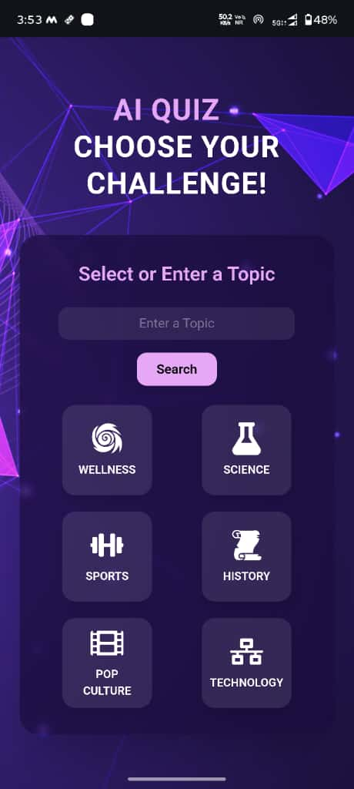
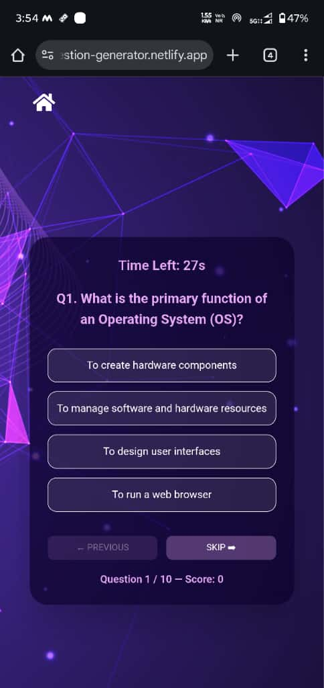
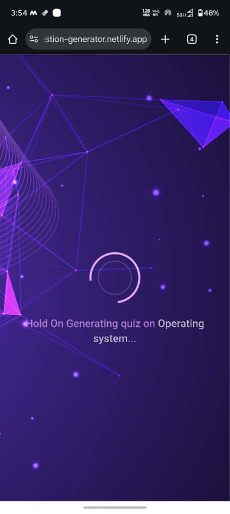

 An interactive AI-powered quiz platform built using React and TailwindCSS, integrated with the Google Gemini API.
This app dynamically generates multiple-choice questions (MCQs) based on a topic entered by the user.

It provides:

⏱️ A 30-second timer per question — once the time runs out, the candidate can no longer answer.

🤖 Personalized AI feedback at the end of the quiz based on performance.

⚡ A seamless and responsive user interface powered by TailwindCSS.

The Gemini API is used to generate quiz questions and feedback.
It works by sending a prompt inside the request body (cURL or fetch call) to the Gemini model endpoint.
The prompt instructs the model to generate 10 MCQ-style questions with 4 options and a clearly marked correct answer for the selected topic.

Features

💬 AI-Generated Quizzes – Generates topic-specific questions and answers using Google Gemini API.

⏱️ 30-Second Timer – Automatically locks answering after time runs out.

🧩 Multiple-Choice Interface – Users can navigate between questions with instant visual feedback.

🎯 Auto-Scoring – Calculates total score dynamically.

💡 AI Feedback – Gemini generates personalized motivational feedback after the quiz.

🏠 Clean UI – Responsive and styled with Tailwind CSS.

Tech Stack

Frontend-React.js + Vite
Styling	-Tailwind CSS
Icons-	React Icons
Notifications-	React Toastify
API	Google Gemini 2.5 Flash Model(since it is free and provide quite large number of tokens)
State Management	-React Hooks (useState, useEffect)

Architecture Overview------
Frontend Architecture

Entry Point: main.jsx → renders App.jsx

Routing: / (Home) → /quiz (Questions Component) → /result (Result Component)

API Calls: Made directly from Questions.jsx to Gemini API using fetch.

Component Structure:

src/
├── components/
│   ├── Loader.jsx (custom loader) for showing loading
│   └── Result.jsx (final result component)
├── pages/
│   └── Questions.jsx
├── App.jsx
├── main.jsx
└── index.css

State Management Choices

useState for local states (score, timer, questions, etc.).

useEffect for side effects like API calls and countdown timers.

answers stored in an object keyed by question index for efficient lookup.

Reason: React hooks provide simplicity and isolation of logic per question; Redux or Context wasn’t necessary for this scale.

Prompts Used (for Gemini API)

You are a quiz master.
Begin with a short introduction for the candidate (1–2 lines).
Then generate 10 multiple-choice questions (easy to hard) with 4 options and the correct answer clearly mentioned.
Topic: ${topic}.
Format strictly as:
Intro text
Q1. question
A) option1
B) option2
C) option3
D) option4
Answer: correct option

## 🖼️ Screenshots
<!-- Desktop screen and mobile screen -->

### 🏠 Home Screen
<!-- desktop screen -->
.png)
<!-- mobile screen -->

### ❓ Quiz Screen
<!-- desktop screen -->
.png)
<!-- mobile screen -->

### ⏱️ Timer Running
<!-- desktop screen -->
.png)
<!-- mobile screen -->

### 🏁 Result with AI Feedback
.png)

### Loader running
.png)
<!-- mobile screen -->

🧩 Known Issues

Gemini API sometimes returns malformed question formatting because of free version which has limitations it might face downtime when number of user increases

Retry mechanism may not always succeed when the API is overloaded.

Timer continues if user navigates away from tab (minor UX issue).

No persistence — quiz resets on refresh, as we are not using database like of firebase ,mongodb etc write now.

Potential Improvements----

Store quiz history and scores in Firebase or localStorage so that user can able to see

authenticate user before entering into the quiz so that dataof user can be stored 

Add difficulty-level selection before starting quiz.

Implement leaderboard and user profiles.

Use Zustand or Redux for scalable state management write now since we dont have to managa a lots of state so we are using state variable only to store and update state.

